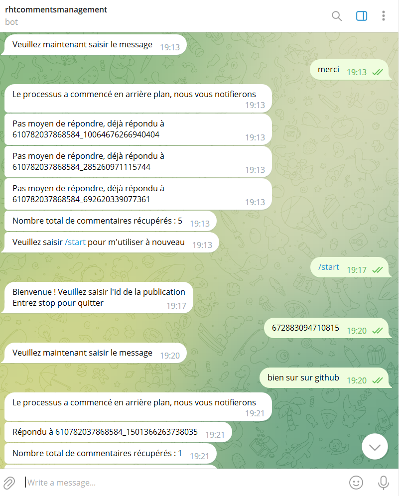

# Installation et Prérequis

## Prérequis

- [MongoDB](https://www.mongodb.com/) : Une base de données NoSQL.
- [Python](https://www.python.org/) : Le langage de programmation utilisé dans ce projet.
- [Telegram](https://www.directual.com/lesson-library/how-to-create-a-telegram-bot) : Creer un bot telegram et recuperer le token
- [Facebook](https://developers.facebook.com/tools/explorer/): Obtenir votre token facebook pour la page

## Installation

1. **MongoDB :** Suivez les instructions [ici](https://docs.mongodb.com/manual/installation/) pour installer MongoDB sur votre système.

2. **Python :** Si Python n'est pas déjà installé, téléchargez et installez la dernière version depuis le [site officiel](https://www.python.org/downloads/).

3. **Virtualenv (facultatif) :** Pour isoler les dépendances de ce projet, il est recommandé d'utiliser un environnement virtuel. Vous pouvez l'installer via pip :


4. **Clonage du projet :** Clonez ce projet depuis GitHub en utilisant la commande suivante :``git clone https://github.com/sosthene14/auto_respons_facebook_comments``

5. **Install requirements :** ``pip install -r requirements.txt``

6. ``python handler_bot.py``


# Fichier `check_telegram_user_id.py`

Ce fichier contient la fonction permetant de vérifier si l'id de l'utilisateur du bot Telegram est présent dans la base de données mongo db qui a devra etre au préalablement créee et contenir les ids des utilisateurs autorisés


## Paramètres

- `user_id` (int): L'identifiant de l'utilisateur Telegram à vérifier.

## Retour

- `True` si l'utilisateur Telegram est présent dans la base de données.
- `False` sinon.

## Utilisation

```python
from pymongo import MongoClient

def check_telegram_user_id(user_id):
    """
    Cette fonction vérifie si un utilisateur Telegram est présent dans la base de données.

    Args:
        user_id (int): L'identifiant de l'utilisateur Telegram à vérifier.

    Returns:
        bool: True si l'utilisateur Telegram est présent dans la base de données, False sinon.
    """
    global client
    try:
        client = MongoClient("url de votre base de données")
        database = client["users"]
        collection = database["telegram_admin"]
        existing_user = collection.find_one({"user_id": user_id})
        if existing_user:
            return True
        else:
            return False
    except Exception as e:
        print(f"Une erreur s'est produite : {str(e)}")
    finally:
        client.close()

```
# Fichier `insert_to_db`

Ce fichier contient la fonction permettant d'insérer un commentaire dans la base de données MongoDB.


## Paramètres

- `where_to_insert` (str): L'endroit où insérer le commentaire dans la base de données.
- `comment_id` (str): L'ID du commentaire.
- `comment_content` (str): Le contenu du commentaire.
- `page_id` (str): L'ID unique de votre page facebook, pour empecher le bot de repondre à ces propres commentaires.
- `user_unique_id` (str): L'ID unique de l'utilisateur.

## Retour

- `True` si l'insertion du commentaire est réussie.
- `False` si le commentaire existe déjà pour l'objet spécifié.

## Utilisation

```python
import pymongo

# Fonction pour insérer un commentaire dans la base de données MongoDB
def insertToDB(whereToInsert, commentID, commentContent, rostelId, userUniqueId):
    """
    Args:
        where_to_insert (str): L'endroit où insérer le commentaire dans la base de données.
        comment_id (str): L'ID du commentaire.
        comment_content (str): Le contenu du commentaire.
        page_id (str): L'ID de l'utilisateur Rostrl.
        user_unique_id (str): L'ID unique de l'utilisateur.

    Returns:
        bool: True si l'insertion du commentaire est réussie, False si le commentaire existe déjà pour l'objet spécifié.
    """
    global client
    try:

        # ... (code de la fonction)

    except Exception as e:
        print(f"Une erreur s'est produite : {str(e)}")
    finally:
        # Fermeture de la connexion à la base de données dans le bloc finally
        client.close()

# Exemple d'utilisation de la fonction
```
# Fichier `respond_to`

Cette fonction permet de répondre à un commentaire sur Facebook en utilisant l'API Graph.

## Paramètres

- `comment_id` (str): L'identifiant du commentaire auquel répondre.
- `access_token` (str): Le token d'accès permettant d'authentifier la requête à l'API Graph de Facebook.
- `message_to_respond` (str): Le message à envoyer en réponse au commentaire.

## Utilisation

```python
import requests
import json

def respondTo(comment_id, access_token, message_to_respond):
    """
    Cette fonction permet de répondre à un commentaire sur Facebook en utilisant l'API Graph.

    Args:
        comment_id (str): L'identifiant du commentaire auquel répondre.
        access_token (str): Le token d'accès permettant d'authentifier la requête à l'API Graph de Facebook.
        message_to_respond (str): Le message à envoyer en réponse au commentaire.

    Returns:
        None

    Raises:
        Exception: Si une erreur se produit lors de la publication du commentaire.

    Usage:
        respondTo(comment_id, access_token, message_to_respond)
    """
    # ... (code de la fonction)

# Exemple d'utilisation de la fonction
```
# Fichier `handle_comments`

Cette fonction gère les commentaires sur une publication Facebook en récupérant les commentaires, en les traitant et en répondant automatiquement à certains d'entre eux.

## Paramètres

- `reel_id` (str): L'identifiant de la publication Facebook à laquelle les commentaires sont associés.
- `message` (str): Le message à envoyer en réponse aux commentaires.

## Retour

- Une liste de réponses sous forme de chaînes de caractères, indiquant si une réponse a été postée ou non pour chaque commentaire.

## Utilisation

```python
import requests
from insert_to_db import insertToDB
from respond_to import respondTo

def handle_comments(reel_id, message):
    """
    Cette fonction gère les commentaires sur une publication Facebook en récupérant les commentaires, en les traitant
    et en répondant automatiquement à certains d'entre eux.

    Args:
        reel_id (str): L'identifiant de la publication Facebook à laquelle les commentaires sont associés.
        message (str): Le message à envoyer en réponse aux commentaires.

    Returns:
        list: Une liste de réponses sous forme de chaînes de caractères, indiquant si une réponse a été postée ou non
        pour chaque commentaire.

    Usage:
        handle_comments(reel_id, message)
    """
    # ... (code de la fonction)

# Exemple d'utilisation de la fonction
```

# handle_bot.py

Ce script permet de gérer la conversation avec le bot.




## Fonctions

### Fonction `start`

La fonction `start` démarre la conversation en vérifiant l'accès de l'utilisateur et en lui demandant de saisir l'ID de la publication.

#### Paramètres

- `update` (Update): L'objet Update de Telegram.
- `context` (CallbackContext): Le contexte de la conversation.

#### Retour

- Un entier représentant l'étape suivante de la conversation.

### Fonction `check_post_id`

La fonction `check_post_id` vérifie l'ID de la publication saisie par l'utilisateur.

#### Paramètres

- `update` (Update): L'objet Update de Telegram.
- `context` (CallbackContext): Le contexte de la conversation.

#### Retour

- Un entier représentant l'étape suivante de la conversation.

### Fonction `get_message`

La fonction `get_message` permet à l'utilisateur de saisir un message et effectue des actions en fonction de la réponse de l'utilisateur.

#### Paramètres

- `update` (Update): L'objet Update de Telegram.
- `context` (CallbackContext): Le contexte de la conversation.

#### Retour

- Un entier représentant l'étape suivante de la conversation.

### Fonction `stop`

La fonction `stop` permet à l'utilisateur d'arrêter la conversation.

#### Paramètres

- `update` (Update): L'objet Update de Telegram.
- `context` (CallbackContext): Le contexte de la conversation.

#### Retour

- Un entier représentant l'étape suivante de la conversation.

### Fonction `start_over`

La fonction `start_over` permet à l'utilisateur de redémarrer la conversation en saisissant à nouveau l'ID de la publication.

#### Paramètres

- `update` (Update): L'objet Update de Telegram.
- `context` (CallbackContext): Le contexte de la conversation.

#### Retour

- Un entier représentant l'étape suivante de la conversation.

## Utilisation

- Le script utilise la bibliothèque `python-telegram-bot` pour gérer les interactions avec les utilisateurs de Telegram.
- Il commence par demander à l'utilisateur de saisir l'ID de la publication.
- L'utilisateur peut saisir "stop" à tout moment pour interrompre la conversation.
- Une fois que l'utilisateur a saisi l'ID de la publication et le message, le script effectue des actions en fonction de ces informations.
- Les réponses de l'utilisateur sont stockées temporairement dans un dictionnaire `user_data`.
- Le script utilise une ConversationHandler pour gérer les étapes de la conversation.
- Vous pouvez personnaliser davantage ce script en fonction de vos besoins spécifiques.

# MIT License

Permission is hereby granted, free of charge, to any person obtaining a copy
of this software and associated documentation files (the "Software"), to deal
in the Software without restriction, including without limitation the rights
to use, copy, modify, merge, publish, distribute, sublicense, and/or sell
copies of the Software, and to permit persons to whom the Software is
furnished to do so, subject to the following conditions:

The above copyright notice and this permission notice shall be included in all
copies or substantial portions of the Software.

THE SOFTWARE IS PROVIDED "AS IS", WITHOUT WARRANTY OF ANY KIND, EXPRESS OR
IMPLIED, INCLUDING BUT NOT LIMITED TO THE WARRANTIES OF MERCHANTABILITY,
FITNESS FOR A PARTICULAR PURPOSE AND NONINFRINGEMENT. IN NO EVENT SHALL THE
AUTHORS OR COPYRIGHT HOLDERS BE LIABLE FOR ANY CLAIM, DAMAGES OR OTHER
LIABILITY, WHETHER IN AN ACTION OF CONTRACT, TORT OR OTHERWISE, ARISING FROM,
OUT OF OR IN CONNECTION WITH THE SOFTWARE OR THE USE OR OTHER DEALINGS IN THE
SOFTWARE.
